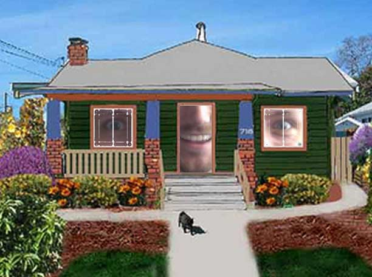
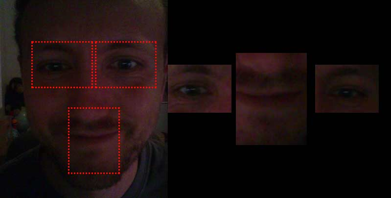
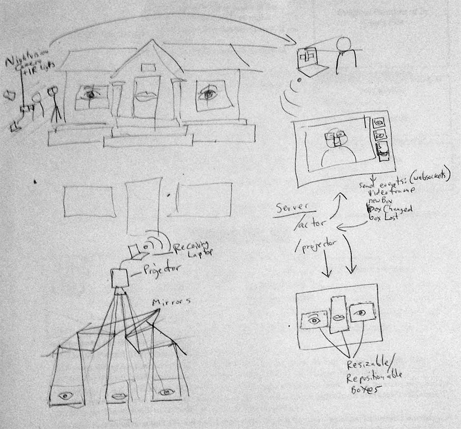

#[Talking House](http://talkinghouse.herokuapp.com/new)

A [web application](http://talkinghouse.herokuapp.com/new)for projecting video-captured facial features onto a house, streamed from a performer computer to a projector computer over webRTC.

Right now the web applications (performer and projector windows) look like this:

Currently has really slow framerates, I believe it's because the way I've gone about is to stream the `<video>` from WebRTC onto a `<canvas>`, and then slice from that canvas onto a second one.  So that's two steps of re-copying.  I am curious if texture-mapping webGL objects would be faster, and may try that next.

For example, I'll be trying to project it on a house in this pattern:

Consists of three node applications:  Performer, Projector, and Server.

You should `npm install` in the root directory as well as the `projector` and `performer` directories.  From there, a simple `npm start` should get the program running for you on port 8084.  Visit `localhost:8084/new` to generate a unique room link, for streaming a single performance to a specific (or even multiple) projectors.

If you want to customize the regions to grab and display, edit `/lib/defaults.js`.